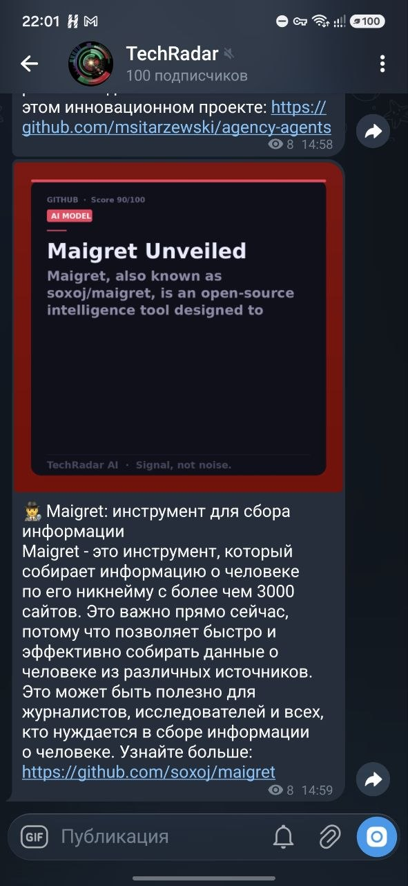

# 🔭 TechRadar AI

> **Принцип: публикуй МЕНЬШЕ, но ЛУЧШЕ. Качество важнее количества.**

Полностью автоматизированная система контент-дистрибуции для AI и dev-инструментов.
Собирает тренды, жёстко фильтрует их через LLM, генерирует посты и одновременно публикует на несколько платформ.

🔗 **Сайт:** <https://nebula387.github.io/TechRadar>  
📱 **Telegram:** <https://t.me/ai_tech_radar>



---

## Платформы

| Канал | Язык | Формат | Статус |
| --- | --- | --- | --- |
| 📱 Telegram (`@ai_tech_radar`) | Русский 🇷🇺 | Короткий пост + карточка | ✅ Работает |
| 🌐 Website (GitHub Pages) | Английский 🇬🇧 | Полная статья | ✅ Работает |
| 🟠 Reddit | Английский 🇬🇧 | Пост в r/MachineLearning | 🔜 Позже |
| 🐦 Twitter/X | Английский 🇬🇧 | Тред 3–5 твитов | 🔜 Позже |
| 💼 LinkedIn | Английский 🇬🇧 | Профессиональный пост | 🔜 Позже |

---

## Как это работает

```
[Коллекторы: GitHub Trending, HN, HuggingFace, ArXiv, ProductHunt]
        ↓
[Stage 1: Жёсткая предварительная фильтрация — без LLM]
  — отбрасывает туториалы, "awesome" списки, мало звёзд/апвоутов
        ↓
[Stage 2: LLM-судья — ОДИН батч-запрос на все кандидаты]
  — NVIDIA NIM (primary) → Groq (fallback)
  — ставит оценку 0–100, одобряет только ≥ 85
  — ожидаемый процент отклонения: 70–85%
        ↓
[Генерация контента — asyncio.gather(), параллельно]
  — Telegram: русский пост (OpenRouter → NVIDIA)
  — Instagram: подпись + хэштеги
  — Website: SEO-статья 300–400 слов на английском
        ↓
[Генерация карточки 1080×1080 (Pillow, пиксельный рендеринг)]
        ↓
[Публикация на все включённые каналы]
  — Telegram: фото + русская подпись до 1024 символов
  — Website: feed.json + PNG коммитятся в git
        ↓
[SQLite: дедупликация, история, дневной лимит]
```

**До 3 постов в день на сайт.** В Telegram уходит только 1 — лучший по оценке LLM. Лучше молчать, чем публиковать шум.

---

## Быстрый старт

### 1. Клонировать репозиторий

```bash
git clone https://github.com/nebula387/TechRadar.git
cd TechRadar
```

### 2. Установить зависимости

```bash
pip install -r requirements.txt
```

### 3. Настроить переменные окружения

```bash
cp .env.example .env
# Открыть .env и заполнить ключи
```

Минимальный набор для старта:
- `TELEGRAM_BOT_TOKEN` — токен бота (получить у [@BotFather](https://t.me/botfather))
- `TELEGRAM_CHANNEL_ID` — username канала (`@mychannel`) или numeric ID
- `NVIDIA_API_KEY` — [build.nvidia.com](https://build.nvidia.com/) (бесплатные кредиты при регистрации)
- `OPENROUTER_API_KEY` — [openrouter.ai](https://openrouter.ai/) (бесплатно)

### 4. Добавить бота в канал как администратора

Бот должен быть добавлен в канал `@ai_tech_radar` с правом **"Post Messages"**:

1. Открыть канал → Администраторы → Добавить администратора
2. Найти бота по username
3. Включить права: Post Messages

### 5. Тестовый запуск

```bash
python -m app.main --source github_trending --dry-run   # без публикации
python -m app.main --source github_trending              # реальная публикация
```

---

## CLI-команды

```bash
# Запуск пайплайна
python -m app.main --source github_trending
python -m app.main --source all
python -m app.main --dry-run --source github_trending   # без публикации, превью в бот

# Тест карточек (генерирует 3 PNG в data/test_cards/)
python test_card.py

# Telegram-бот
python -m app.bot                      # запустить бот (для режима одобрения)
python -m app.bot --test               # проверить подключение
python -m app.bot --clear-channel      # удалить все сообщения из канала

# Управление базой данных
python -m app.manage stats             # статистика
python -m app.manage list              # список опубликованных
python -m app.manage clear             # удалить все записи
python -m app.manage clear --date 2026-06-22   # удалить за дату

# Сайт
python -m app.rebuild_website          # пересобрать HTML из feed.json
```

---

## Настройка GitHub Actions

### 1. Добавить секреты в GitHub

Путь: Settings → Secrets and variables → Actions → Secrets tab

| Секрет | Описание |
|---|---|
| `TELEGRAM_BOT_TOKEN` | Токен Telegram-бота (от @BotFather) |
| `TELEGRAM_CHANNEL_ID` | Username канала, например `@ai_tech_radar` |
| `TELEGRAM_ADMIN_CHAT_ID` | Ваш личный chat ID (от @userinfobot) |
| `NVIDIA_API_KEY` | NVIDIA NIM API key (build.nvidia.com) |
| `GROQ_API_KEY` | Groq API key (console.groq.com) |
| `OPENROUTER_API_KEY` | OpenRouter API key (openrouter.ai) |

### 2. Добавить переменные (Variables tab)

| Переменная | Значение |
|---|---|
| `WEBSITE_BASE_URL` | `https://nebula387.github.io/TechRadar` |
| `ENABLE_INSTAGRAM` | `false` (включить после настройки) |

### 3. Включить GitHub Pages

Путь: Settings → Pages → Source: GitHub Actions

После первого успешного запуска сайт будет на `https://nebula387.github.io/TechRadar`.

### 4. Ручной запуск

Путь: Actions → TechRadar AI Pipeline → Run workflow

Параметры:

- `source` — источник (по умолчанию `github_trending`)
- `enable_telegram` — публиковать в Telegram (`true`/`false`, по умолчанию `true`)

Поставить `enable_telegram: false` чтобы пересобрать сайт без повторной отправки в Telegram.

---

## Архитектура сайта (Rebuild-at-Deploy)

HTML никогда не коммитится в git. В репозитории хранятся только данные:

```
run-pipeline job:
  collect → filter → LLM → generate → publish
  git commit: feed.json + images/ + techradar.db

deploy-pages job:
  python -m app.rebuild_website   ← пересобирает весь HTML из feed.json
  deploy to GitHub Pages
```

Это значит: любое изменение шаблонов/CSS автоматически применяется ко ВСЕМ историческим постам при следующем деплое.

---

## Структура проекта

```
TechRadar/
├── app/
│   ├── collectors/           # GitHub, HN, HuggingFace, ArXiv, ProductHunt
│   ├── filter/
│   │   ├── quality_gate.py   # Stage 1: жёсткие правила (без LLM)
│   │   └── llm_judge.py      # Stage 2: батч LLM-оценка (1 API-вызов)
│   ├── llm/
│   │   ├── client.py         # NVIDIA→Groq (фильтр), OpenRouter→NVIDIA (генерация)
│   │   └── generate.py       # Telegram RU + Instagram + Website EN
│   ├── image/
│   │   └── card.py           # Pillow 1080×1080
│   ├── publishers/
│   │   ├── telegram.py       # Канал @ai_tech_radar
│   │   ├── instagram.py
│   │   └── website.py        # feed.json + images/
│   ├── database/
│   │   └── storage.py        # SQLite: дедупликация, дневной лимит
│   ├── pipeline.py           # Главный пайплайн
│   ├── main.py               # CLI
│   ├── bot.py                # Telegram-бот (режим одобрения + --clear-channel)
│   ├── manage.py             # DB-admin: stats / list / clear
│   └── rebuild_website.py    # Пересборка HTML из feed.json
│
├── website/
│   ├── static/css/style.css
│   ├── static/js/main.js
│   └── public/
│       ├── feed.json         # ✅ в git — источник правды для всех постов
│       └── images/           # ✅ в git — PNG карточки
│       # posts/ и index.html — в .gitignore, генерируются при деплое
│
├── data/
│   └── techradar.db          # ✅ в git — дедупликация + счётчик
│
├── test_card.py              # Визуальный тест карточек
├── .env.example
├── requirements.txt
└── .github/workflows/
    └── pipeline.yml          # Cron 4×/день + ручной запуск
```

---

## LLM-модели (только бесплатные)

Фильтрация (NVIDIA NIM primary → Groq fallback):

- `meta/llama-3.3-70b-instruct` — основная (NVIDIA NIM, щедрые бесплатные кредиты)
- `qwen/qwen3.6-27b` — резерв (Groq, строгие TPM-лимиты)

Генерация (OpenRouter primary → NVIDIA fallback):

- `google/gemma-2-9b-it:free` — основная (OpenRouter)

**Правило:** На 4xx-ошибке — сразу fail, без повторов. На 429 — ждать до 120 сек, потом переключиться на резерв. Никогда не платить за модели.

---

## Переменные окружения

| Переменная | Описание | По умолчанию |
|---|---|---|
| `TELEGRAM_BOT_TOKEN` | Токен бота | — |
| `TELEGRAM_CHANNEL_ID` | ID/username канала | — |
| `TELEGRAM_ADMIN_CHAT_ID` | Ваш личный chat ID | — |
| `NVIDIA_API_KEY` | NVIDIA NIM API key | — |
| `NVIDIA_MODEL` | Модель NVIDIA | `meta/llama-3.3-70b-instruct` |
| `GROQ_API_KEY` | Groq API key | — |
| `GROQ_MODEL` | Модель Groq | `qwen/qwen3.6-27b` |
| `OPENROUTER_API_KEY` | OpenRouter API key | — |
| `OPENROUTER_MODEL` | Модель OpenRouter | `google/gemma-2-9b-it:free` |
| `MIN_SCORE` | Минимальный скор | `85` |
| `MAX_POSTS_PER_DAY` | Лимит публикаций/день | `1` |
| `ENABLE_TELEGRAM` | Публиковать в Telegram | `true` |
| `ENABLE_WEBSITE` | Публиковать на сайт | `true` |
| `WEBSITE_BASE_URL` | URL сайта | `https://nebula387.github.io/TechRadar` |
| `WEBSITE_OUTPUT_DIR` | Папка вывода | `./website/public` |

---

## Диагностика — Telegram не получает сообщения

Проверить по порядку:

1. **Бот — администратор канала?**  
   Канал → Управление → Администраторы → бот должен быть с правом "Post Messages".

2. **Дневной лимит не исчерпан?**

   ```bash
   python -m app.manage stats
   ```

   Если сегодня уже 1 публикация — пайплайн пропускает запуск.

3. **Посмотреть логи GitHub Actions**  
   Actions → последний запуск → шаг "Run TechRadar pipeline".  
   Ключевые фразы в логе:
   - `"Daily limit reached"` — лимит исчерпан
   - `"All items rejected by LLM judge"` — ничего не прошло фильтр
   - `"Published to telegram"` — успешно

4. **Неверный формат TELEGRAM_CHANNEL_ID в Secrets?**  
   Должен быть `@ai_tech_radar` (не `t.me/...`).

---

## Лицензия

MIT — свободное использование.
